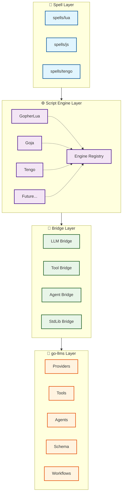

# go-llmspell Architecture

## Overview

go-llmspell is designed as a multi-layered system that provides scriptable interfaces to the go-llms library. It enables developers to write "spells" (scripts) in various languages (Lua, JavaScript, Tengo) that can orchestrate LLM interactions, tools, agents, and workflows.

## Core Design Principles

1. **Registry-based Extensibility**: Use registry patterns for script engines, tools, and agents to allow runtime extension
2. **Uniform Script API**: Provide a consistent interface across all scripting languages
3. **Lazy Loading**: Load engines and resources only when needed to optimize performance
4. **Context-aware Execution**: Ensure proper isolation and context management for security
5. **Bridge Pattern**: Maintain clean separation between Go runtime and script environments

## Architectural Layers



```
┌─────────────────────────────────────────────────────┐
│                 Spell Layer                         │
│         (spells/lua, spells/js, spells/tengo)       │
└─────────────────────┬───────────────────────────────┘
                      │
┌─────────────────────┴───────────────────────────────┐
│              Script Engine Layer                    │
│   ┌──────────┬──────────┬──────────┬──────────┐     │
│   │GopherLua │   Goja   │  Tengo   │ Future...│     │
│   └──────────┴──────────┴──────────┴──────────┘     │
│                  Engine Registry                    │
└─────────────────────┬───────────────────────────────┘
                      │
┌─────────────────────┴───────────────────────────────┐
│               Bridge Layer                          │
│  ┌─────────┬────────┬─────────┬──────────────┐      │
│  │   LLM   │  Tool  │  Agent  │   StdLib     │      │
│  │ Bridge  │ Bridge │ Bridge  │   Bridge     │      │
│  └─────────┴────────┴─────────┴──────────────┘      │
└─────────────────────┬───────────────────────────────┘
                      │
┌─────────────────────┴───────────────────────────────┐
│                 go-llms Layer                       │
│   Providers, Tools, Agents, Schema, Workflows       │
└─────────────────────────────────────────────────────┘
```

### Layer Descriptions

1. **Spell Layer**: User-created scripts that implement specific functionality
2. **Script Engine Layer**: Language-specific interpreters with a common interface
3. **Bridge Layer**: Go code that exposes functionality to script environments
4. **go-llms Layer**: The underlying LLM library providing core capabilities

## Key Components

### Script Engine Interface

The core abstraction that all script engines must implement:

```go
type ScriptEngine interface {
    // Name returns the engine identifier (e.g., "lua", "javascript", "tengo")
    Name() string
    
    // LoadScript loads a script from a reader
    LoadScript(reader io.Reader) error
    
    // LoadFile loads a script from a file path
    LoadFile(path string) error
    
    // Execute runs the loaded script with the given context
    Execute(ctx context.Context) (*ExecutionResult, error)
    
    // RegisterBinding registers a Go function or value in the script environment
    RegisterBinding(name string, binding interface{}) error
    
    // SetGlobal sets a global variable in the script environment
    SetGlobal(name string, value interface{}) error
}

type ExecutionResult struct {
    Output   string
    Error    error
    Logs     []LogEntry
    Metrics  map[string]interface{}
    Duration time.Duration
}
```

### Engine Registry

Manages available script engines and their factories:

```go
type EngineRegistry struct {
    engines map[string]EngineFactory
    mu      sync.RWMutex
}

type EngineFactory func(config *EngineConfig) (ScriptEngine, error)

type EngineConfig struct {
    MemoryLimit   int64         // Memory limit in bytes
    Timeout       time.Duration // Execution timeout
    EnableDebug   bool          // Enable debug output
    CustomOptions map[string]interface{}
}
```

### Script Runner

The main orchestrator that coordinates engine selection, bridge injection, and execution:

```go
type ScriptRunner struct {
    registry    *EngineRegistry
    bridges     *BridgeSet
    spellLoader *SpellLoader
    config      *RunnerConfig
}

type RunnerConfig struct {
    SpellDirectories []string
    DefaultEngine    string
    GlobalTimeout    time.Duration
    SecurityPolicy   *SecurityPolicy
}
```

## Bridge Components

### LLM Bridge

Provides access to LLM functionality:

```go
type LLMBridge interface {
    // Basic LLM operations
    Chat(ctx context.Context, prompt string) (string, error)
    Complete(ctx context.Context, prompt string, maxTokens int) (string, error)
    StreamChat(ctx context.Context, prompt string, callback func(chunk string) error) error
    
    // Provider management
    SetProvider(provider string) error
    SetModel(model string) error
    ListProviders() []string
    ListModels() []string
}
```

### Tool Bridge

Enables creation and execution of tools:

```go
type ToolBridge interface {
    // Tool creation and management
    CreateTool(name, description string, params map[string]interface{}) Tool
    RegisterTool(tool Tool) error
    ExecuteTool(name string, args map[string]interface{}) (interface{}, error)
    ListTools() []ToolInfo
    
    // Tool discovery
    LoadToolFromFile(path string) error
    LoadToolsFromDirectory(dir string) error
}

type Tool interface {
    Name() string
    Description() string
    Parameters() map[string]interface{}
    Execute(args map[string]interface{}) (interface{}, error)
}
```

### Agent Bridge

Provides agent creation and management:

```go
type AgentBridge interface {
    // Agent operations
    CreateAgent(config AgentConfig) Agent
    RunAgent(agentID string, input string) (string, error)
    ListAgents() []AgentInfo
    RegisterAgent(agent Agent) error
    
    // Agent persistence
    SaveAgent(agentID string, path string) error
    LoadAgent(path string) (Agent, error)
}

type AgentConfig struct {
    Name         string
    SystemPrompt string
    Tools        []string
    MaxTokens    int
    Temperature  float64
}
```

### Workflow Bridge

Enables workflow creation and execution:

```go
type WorkflowBridge interface {
    // Workflow management
    CreateWorkflow(steps []WorkflowStep) Workflow
    ExecuteWorkflow(workflowID string, input map[string]interface{}) (interface{}, error)
    RegisterWorkflow(workflow Workflow) error
    
    // Workflow composition
    ChainWorkflows(workflows ...Workflow) Workflow
    ParallelWorkflows(workflows ...Workflow) Workflow
}

type WorkflowStep struct {
    Name      string
    Type      string // "agent", "tool", "llm", "conditional"
    Config    map[string]interface{}
    OnSuccess string // Next step on success
    OnFailure string // Next step on failure
}
```

### StdLib Bridge

Provides curated access to Go standard library functionality:

```go
type StdLibBridge interface {
    // File operations
    FileRead(path string) (string, error)
    FileWrite(path string, content string) error
    FileExists(path string) bool
    
    // HTTP operations
    HTTPGet(url string) (string, error)
    HTTPPost(url string, body string) (string, error)
    
    // JSON operations
    JSONEncode(v interface{}) (string, error)
    JSONDecode(s string) (interface{}, error)
    
    // Logging
    LogInfo(args ...interface{})
    LogError(args ...interface{})
    LogDebug(args ...interface{})
    
    // Time operations
    TimeNow() time.Time
    TimeSleep(duration time.Duration)
    TimeFormat(t time.Time, format string) string
}
```

## Spell Organization

Spells are organized in a hierarchical directory structure:

```
spells/
├── lua/
│   ├── core/
│   │   ├── init.lua         # Core utilities and helpers
│   │   └── helpers.lua      # Common helper functions
│   ├── tools/
│   │   ├── web_search.lua   # Web search tool implementation
│   │   ├── calculator.lua   # Calculator tool
│   │   └── json_parser.lua  # JSON parsing tool
│   ├── agents/
│   │   ├── researcher.lua   # Research assistant agent
│   │   ├── coder.lua        # Coding assistant agent
│   │   └── writer.lua       # Writing assistant agent
│   └── workflows/
│       ├── blog_writer.lua  # Blog writing workflow
│       └── code_review.lua  # Code review workflow
├── javascript/
│   └── ... (similar structure)
└── tengo/
    └── ... (similar structure)
```

### Spell Metadata

Each spell can include metadata for discovery and documentation:

```yaml
# spell.yaml
name: "web_researcher"
version: "1.0.0"
engine: "lua"
description: "Research agent that searches the web and summarizes findings"
author: "llmspell-community"
dependencies:
  - "web_search"
  - "summarizer"
parameters:
  - name: "query"
    type: "string"
    required: true
    description: "Research query"
  - name: "max_results"
    type: "number"
    default: 5
    description: "Maximum number of results to process"
```

## Script API Design

Each script engine exposes a consistent API regardless of the underlying language:

### Lua Example

```lua
-- LLM operations
local response = llm.chat("Hello, how are you?")
local completion = llm.complete("The meaning of life is", {max_tokens = 100})

-- Streaming
llm.stream("Tell me a story", function(chunk)
    io.write(chunk)
end)

-- Tool creation
local calculator = tool.create({
    name = "calculator",
    description = "Performs mathematical calculations",
    parameters = {
        expression = {type = "string", required = true}
    },
    execute = function(params)
        return {result = evaluate(params.expression)}
    end
})

-- Agent creation
local agent = agent.create({
    name = "researcher",
    tools = {"web_search", "calculator"},
    system_prompt = "You are a helpful research assistant"
})

local result = agent.run("What is the population of Tokyo?")

-- Workflow
local workflow = workflow.create({
    steps = {
        {name = "search", type = "tool", tool = "web_search"},
        {name = "summarize", type = "agent", agent = "summarizer"},
        {name = "save", type = "tool", tool = "file_writer"}
    }
})

-- Logging
log.info("Starting research workflow")
log.debug("Agent result:", result)

-- File operations
local content = fs.read("data.json")
local data = json.decode(content)
fs.write("output.json", json.encode(data))

-- HTTP operations
local response = http.get("https://api.example.com/data")
local result = http.post("https://api.example.com/process", {
    body = json.encode({query = "test"}),
    headers = {["Content-Type"] = "application/json"}
})
```

### JavaScript Example

```javascript
// LLM operations
const response = await llm.chat("Hello, how are you?");
const completion = await llm.complete("The meaning of life is", {maxTokens: 100});

// Tool creation
const calculator = tool.create({
    name: "calculator",
    description: "Performs calculations",
    parameters: {
        expression: {type: "string", required: true}
    },
    execute: async (params) => {
        return {result: eval(params.expression)};
    }
});

// Agent usage
const agent = agent.create({
    name: "researcher",
    tools: ["web_search", "calculator"],
    systemPrompt: "You are a helpful research assistant"
});

const result = await agent.run("What is the population of Tokyo?");

// Logging and file operations
log.info("Agent result:", result);
const data = JSON.parse(fs.read("data.json"));
fs.write("output.json", JSON.stringify(data));
```

### Tengo Example

```go
// LLM operations
response := llm.chat("Hello, how are you?")
completion := llm.complete("The meaning of life is", {max_tokens: 100})

// Tool usage
result := tool.execute("calculator", {expression: "2 + 2"})

// Agent
agent := agent.create({
    name: "researcher",
    tools: ["web_search"],
    system_prompt: "Research assistant"
})

result := agent.run("Latest AI news")

// Utilities
log.info("Result: " + result)
data := json.decode(fs.read("data.json"))
```

## Execution Flow

1. **Spell Discovery**: Scanner finds spells in configured directories
2. **Engine Selection**: Choose engine based on file extension or metadata
3. **Context Creation**: Set up execution context with security policies
4. **Bridge Injection**: Register all bridges with the script engine
5. **Script Execution**: Run the spell with proper error handling
6. **Result Collection**: Gather outputs, logs, metrics, and errors
7. **Cleanup**: Release resources and close connections

## Configuration

The system is configured via YAML:

```yaml
# llmspell.yaml
engines:
  lua:
    enabled: true
    memory_limit: 100MB
    timeout: 30s
    sandbox: strict
  javascript:
    enabled: true
    memory_limit: 200MB
    timeout: 60s
  tengo:
    enabled: true
    memory_limit: 50MB

bridges:
  llm:
    default_provider: "openai"
    default_model: "gpt-4"
    timeout: 120s
  tools:
    discovery_paths:
      - "./tools"
      - "~/.llmspell/tools"
  stdlib:
    allowed_packages:
      - "io"
      - "http"
      - "json"
      - "time"
    filesystem:
      jail: "./workspace"
      max_file_size: 10MB
    http:
      allowed_domains:
        - "*.openai.com"
        - "*.anthropic.com"
      timeout: 30s
      
spells:
  directories:
    - "./spells"
    - "~/.llmspell/spells"
  auto_discover: true
  
security:
  enable_sandboxing: true
  resource_limits:
    max_memory: 500MB
    max_cpu_time: 300s
    max_goroutines: 100
  
logging:
  level: "info"
  output: "stdout"
  format: "json"
```

## Security Considerations

### Sandboxing

Each script engine runs in a sandboxed environment with:
- Limited memory allocation
- CPU time restrictions
- Controlled goroutine creation
- Network access policies

### Resource Limits

```go
type ResourceLimits struct {
    MaxMemory      int64         // Maximum memory in bytes
    MaxCPUTime     time.Duration // Maximum CPU time
    MaxGoroutines  int           // Maximum concurrent goroutines
    MaxOpenFiles   int           // Maximum open file handles
    MaxNetworkReqs int           // Maximum network requests
}
```

### Filesystem Security

- **Jail**: Restrict file access to specific directories
- **Path Validation**: Prevent directory traversal attacks
- **Size Limits**: Enforce maximum file sizes
- **Type Restrictions**: Allow only specific file types

### Network Security

- **Domain Allowlists**: Control which external APIs can be accessed
- **Rate Limiting**: Prevent abuse of external services
- **Request Validation**: Validate and sanitize HTTP requests
- **TLS Enforcement**: Require HTTPS for external calls

### Permission Model

```go
type Permissions struct {
    AllowFileRead    bool
    AllowFileWrite   bool
    AllowNetwork     bool
    AllowProcess     bool
    AllowedDomains   []string
    AllowedPaths     []string
    DeniedPaths      []string
}
```

## Error Handling

The system implements comprehensive error handling:

1. **Script Errors**: Captured and wrapped with context
2. **Resource Errors**: Clear messages for limit violations
3. **Bridge Errors**: Propagated with appropriate context
4. **Security Errors**: Logged and reported without exposing internals

## Performance Optimization

1. **Engine Pooling**: Reuse engine instances when possible
2. **Compiled Scripts**: Cache compiled script representations
3. **Lazy Bridge Loading**: Load bridges only when accessed
4. **Concurrent Execution**: Support parallel spell execution
5. **Result Caching**: Cache deterministic operation results

## Extensibility Points

1. **New Script Engines**: Implement ScriptEngine interface
2. **Custom Bridges**: Add new bridge types for additional functionality
3. **Tool Plugins**: Dynamic tool loading system
4. **Custom Security Policies**: Pluggable security validators
5. **Result Processors**: Transform script outputs

## Future Considerations

1. **Distributed Execution**: Run spells across multiple nodes
2. **Spell Marketplace**: Share and discover community spells
3. **Visual Spell Editor**: GUI for creating spells
4. **Debugging Support**: Step-through debugging for spells
5. **Performance Profiling**: Detailed performance metrics
6. **Version Management**: Spell versioning and migration