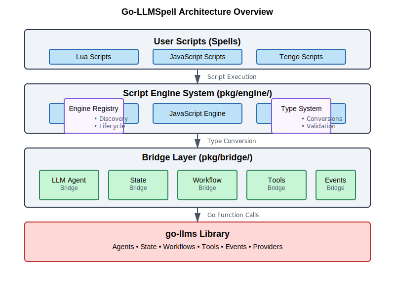
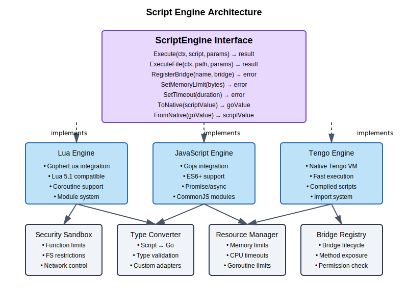

# Go-LLMSpell Architecture

## Table of Contents

1. [Introduction](#introduction)
2. [Why Go-LLMSpell Exists](#why-go-llmspell-exists)
3. [Core Philosophy](#core-philosophy)
4. [Architecture Overview](#architecture-overview)
5. [Bridge-First Design](#bridge-first-design)
6. [Component Architecture](#component-architecture)
7. [Script Engine System](#script-engine-system)
8. [Bridge Layer](#bridge-layer)
9. [Type System](#type-system)
10. [Security Model](#security-model)
11. [Examples](#examples)
12. [Future Considerations](#future-considerations)

---

**Quick Links:**
- [TODO.md](../../TODO.md) - Current implementation tasks
- [TODO-DONE.md](../../TODO-DONE.md) - Completed work tracking
- [Architecture Diagrams](../images/) - SVG diagrams referenced in this document

## Introduction

Go-LLMSpell is a **scriptable interface for LLM interactions** that bridges multiple scripting languages (Lua, JavaScript, Tengo) to the powerful go-llms library. It enables developers to write "spells" - scripts that orchestrate AI agents, workflows, and tools without needing to compile Go code.

### What is a Spell?

A spell is a script written in your language of choice that controls LLMs and their associated tools. Think of it as magical incantations that bring AI capabilities to life through simple, expressive code.

```lua
-- Example spell: Research Assistant
local researcher = llm.agent({
    model = "claude-3-opus",
    tools = {"web_search", "file_write"},
    system = "You are a helpful research assistant"
})

local topic = "quantum computing breakthroughs 2025"
local research = researcher:run("Research " .. topic .. " and summarize findings")
tools.file_write("research_summary.md", research)
```

## Why Go-LLMSpell Exists

### The Problem

1. **Compilation Barrier**: Working with LLMs in Go requires compilation for every change
2. **Rapid Prototyping**: AI workflows need constant iteration and experimentation
3. **Language Preference**: Different teams prefer different scripting languages
4. **Hot Reloading**: Production systems need to update AI behaviors without downtime
5. **Complexity**: Direct go-llms usage requires deep Go knowledge

### The Solution

Go-LLMSpell provides a **bridge-first architecture** that:
- Exposes go-llms functionality through simple scripting APIs
- Supports multiple scripting languages with the same interface
- Enables hot-reloading of AI behaviors
- Maintains type safety at bridge boundaries
- Provides security through sandboxed execution

### Key Benefits

🚀 **Rapid Development**: Test AI workflows instantly without compilation  
🔄 **Hot Reloading**: Update spells in production without restarts  
🌐 **Multi-Language**: Choose Lua, JavaScript, or Tengo based on your needs  
🔒 **Secure**: Sandboxed script execution with resource limits  
🎯 **Type Safe**: Automatic conversions between scripts and Go  
📚 **Reusable**: Build libraries of spells for common tasks  

## Core Philosophy

### 1. Bridge, Don't Build

**Fundamental Rule: If it's not in go-llms, we don't implement it in go-llmspell.**

We exclusively provide bridging interfaces to expose existing go-llms functionality to scripts. We never reimplement features that exist in go-llms. This strict adherence ensures:
- Automatic compatibility with go-llms updates
- Minimal maintenance burden
- Consistent behavior with direct go-llms usage
- No feature drift or divergent implementations

**What This Means in Practice:**
- ✅ Create script bindings for go-llms types and functions
- ✅ Build type converters between script and Go types
- ✅ Implement script engine infrastructure
- ❌ Never implement LLM logic, agents, tools, or workflows ourselves
- ❌ Never add features that should belong in go-llms
- ❌ Never maintain custom versions of go-llms functionality

### 2. Engine-Agnostic Design

All features work identically across Lua, JavaScript, and Tengo. Scripts are portable between engines with minimal changes.

### 3. Script-Friendly APIs

We hide go-llms complexity behind intuitive scripting interfaces. Complex Go patterns become simple script calls.

### 4. Security First

All script execution happens in sandboxed environments with configurable resource limits and permission controls.

### 5. Upstream-First Development

When new features or improvements are needed for core LLM, agent, tools, or workflow functionality, we contribute them upstream to go-llms rather than implementing them locally. This ensures:

- **Community Benefit**: Improvements benefit the entire go-llms ecosystem
- **Maintenance Reduction**: No custom forks or divergent implementations to maintain
- **Quality Assurance**: Changes go through go-llms review and testing processes
- **Long-term Compatibility**: Ensures go-llmspell stays aligned with go-llms evolution

**Contribution Process**:
1. **Identify Need**: Feature required for spell functionality
2. **Evaluate Scope**: Determine if it's core go-llms functionality vs. scripting-specific
3. **Upstream First**: Submit change request (CR) to go-llms if core functionality
4. **Bridge Second**: Create bridge to expose new go-llms feature to scripts
5. **Document**: Update bridges and examples once upstream change is merged

This approach reinforces our bridge-first philosophy and strengthens the broader Go LLM ecosystem.

## Architecture Overview



Go-LLMSpell consists of two main packages:

```
go-llmspell/
├── pkg/
│   ├── engine/          # Script engine interfaces and implementations
│   │   ├── interface.go # Core interfaces (ScriptEngine, Bridge, TypeConverter)
│   │   ├── registry.go  # Engine registry and discovery
│   │   ├── types.go     # Type system and conversions
│   │   ├── gopherlua/   # Lua engine implementation
│   │   ├── javascript/ # JavaScript engine implementation
│   │   └── tengo/      # Tengo engine implementation
│   │
│   └── bridge/         # Bridges to go-llms functionality
│       ├── interfaces.go    # Shared type aliases
│       ├── manager.go       # Bridge lifecycle management
│       ├── modelinfo.go     # Model information bridge
│       ├── agent/           # Agent-related bridges
│       │   ├── agent.go     # LLM agent orchestration
│       │   ├── workflow.go  # Workflow engine
│       │   ├── events.go    # Event system
│       │   ├── hooks.go     # Hook system
│       │   └── tools/       # Tool bridges
│       │       ├── tools.go # Tool system
│       │       └── registry.go # Tool registry
│       ├── llm/             # LLM provider bridges
│       │   ├── llm.go       # Core LLM functionality
│       │   ├── providers.go # Provider implementations
│       │   └── pool.go      # Provider pooling
│       ├── state/           # State management bridges
│       │   ├── manager.go   # State manager
│       │   └── context.go   # Shared state context
│       ├── structured/      # Structured output bridges
│       │   ├── structured.go # Structured processing
│       │   └── schema.go    # Schema validation
│       ├── observability/   # Monitoring bridges
│       │   ├── metrics.go   # Metrics collection
│       │   ├── tracing.go   # Distributed tracing
│       │   └── profiling.go # Performance profiling
│       ├── util/            # Utility bridges
│       │   ├── util.go      # General utilities
│       │   ├── auth.go      # Authentication
│       │   ├── json.go      # JSON operations
│       │   └── llm.go       # LLM utilities
│       └── guardrails.go    # Safety system bridge
```

### Data Flow

```
User Script (Lua/JS/Tengo)
    ↓ [Script API Calls]
Script Engine (pkg/engine/)
    ↓ [Type Conversion]
Bridge Layer (pkg/bridge/)
    ↓ [Go Function Calls]
go-llms Library
    ↓ [Provider APIs]
LLM Providers (OpenAI, Anthropic, etc.)
```

## Bridge-First Design

### What We Build vs What We Bridge

#### We Build (Our Value-Add)
1. **Script Engine System** - Multi-language execution environments
2. **Type Conversion Layer** - Seamless script ↔ Go type conversions  
3. **Bridge Interfaces** - Thin wrappers exposing go-llms to scripts
4. **Language Bindings** - Idiomatic APIs for each scripting language
5. **Script Infrastructure** - Sandboxing, resource limits, hot reload

**Important**: We ONLY create implementations, structs, and interfaces that are necessary to support scripting and bridging. No business logic, no LLM functionality, no duplicating go-llms features.

#### We Bridge (From go-llms)
Everything else comes from go-llms:
1. **LLM Providers** - All provider interfaces and implementations
2. **Agents** - Complete agent system with tools and orchestration
3. **State Management** - StateManager, SharedContext, transforms
4. **Workflows** - All workflow types and execution logic
5. **Tools** - All built-in and custom tool functionality
6. **Event System** - Event streaming and subscriptions
7. **Infrastructure** - Tracing, metrics, hooks, guardrails
8. **Utilities** - JSON, auth, LLM utilities from go-llms/pkg/util

#### We Never Implement
These belong in go-llms, not go-llmspell:
1. **New LLM Features** - Submit upstream to go-llms first
2. **Custom Agents** - Use go-llms agent system
3. **New Tools** - Contribute to go-llms tool library
4. **Workflow Types** - Extend go-llms workflow engine
5. **Memory System** - Wait for go-llms implementation
6. **Any Core Logic** - All intelligence lives in go-llms

### Bridge Implementation Strategy

Each bridge follows these principles:

1. **Thin Wrappers**: Minimal code between scripts and go-llms
2. **Type Safety**: Handle all conversions at bridge boundaries
3. **Error Mapping**: Convert Go errors to script-friendly formats
4. **No Business Logic**: Bridges only translate, never implement features
5. **Direct Delegation**: All functionality comes from go-llms

Example bridge structure:

```go
// Bridge to go-llms StateManager - ONLY wrapping, no implementation
type StateBridge struct {
    manager *core.StateManager  // From go-llms
}

func (b *StateBridge) Methods() []MethodInfo {
    // Define script-accessible methods that map to go-llms
    return []MethodInfo{
        {Name: "createState", Description: "Create new state", ...},
        {Name: "saveState", Description: "Save state", ...},
        // etc - all delegating to go-llms StateManager
    }
}

// Example method - just type conversion and delegation
func (b *StateBridge) saveState(args []interface{}) (interface{}, error) {
    // 1. Convert script types to Go types
    state := convertToGoState(args[0])
    
    // 2. Call go-llms directly
    id, err := b.manager.SaveState(state)
    
    // 3. Convert result back to script types
    return convertToScriptType(id), err
}

// NEVER implement features like this:
// ❌ func (b *StateBridge) customMergeLogic(...) { ... }
// ❌ func (b *StateBridge) myOwnStateFeature(...) { ... }
```

## Component Architecture

### Script Engine System



The Script Engine provides the execution environment for spells:

```go
type ScriptEngine interface {
    // Lifecycle
    Initialize(config EngineConfig) error
    Execute(ctx context.Context, script string, params map[string]interface{}) (interface{}, error)
    ExecuteFile(ctx context.Context, path string, params map[string]interface{}) (interface{}, error)
    Shutdown() error
    
    // Bridge Management
    RegisterBridge(name string, bridge Bridge) error
    UnregisterBridge(name string) error
    
    // Type System
    ToNative(scriptValue interface{}) (interface{}, error)
    FromNative(goValue interface{}) (interface{}, error)
    
    // Resource Management
    SetMemoryLimit(bytes int64) error
    SetTimeout(duration time.Duration) error
}
```

### Bridge Layer


**Critical Design Principle**: Bridges are ONLY thin wrappers around go-llms functionality. They translate between script calls and go-llms APIs but never implement any business logic, LLM features, or custom functionality.

```go
type Bridge interface {
    // Metadata - what go-llms functionality this exposes
    GetID() string
    GetMetadata() BridgeMetadata
    Methods() []MethodInfo
    
    // Lifecycle - setup/teardown only
    Initialize(ctx context.Context) error
    Cleanup(ctx context.Context) error
    
    // Type conversion hints
    TypeMappings() map[string]TypeMapping
    
    // Registration with script engine
    RegisterWithEngine(engine ScriptEngine) error
}
```

**Bridge Implementation Rules:**
1. **Never implement features** - Only wrap go-llms APIs
2. **Never store business state** - Only hold references to go-llms objects
3. **Never add logic** - Only type conversion and method delegation
4. **Never extend functionality** - Submit enhancements to go-llms instead

#### Core Bridges

1. **LLM Agent Bridge** (`agent/agent.go`)
   - Agent creation and configuration
   - Tool registration and execution
   - Sub-agent orchestration
   - Lifecycle hooks and events

2. **State Management Bridge** (`state/manager.go`, `state/context.go`)
   - State lifecycle operations
   - Transforms (filter, flatten, sanitize)
   - Merge strategies
   - Persistence interface

3. **Workflow Bridge** (`agent/workflow.go`)
   - All workflow types (sequential, parallel, conditional, loop)
   - Workflow composition
   - State passing between steps
   - Error handling and recovery

4. **Event System Bridge** (`agent/events.go`)
   - Real-time event streaming
   - Event filtering and subscriptions
   - Event metadata and correlation
   - All event types (lifecycle, tool, workflow)

5. **Tool System Bridge** (`agent/tools/tools.go`)
   - Built-in tool access
   - Custom tool registration
   - Tool composition and chaining
   - Parameter validation

## Type System

### Type Conversion Flow

```
Script Type → TypeConverter → Go Type → go-llms
     ↑                                      ↓
     └──────── TypeConverter ←─────────────┘
```

### Supported Type Mappings

| Script Type | Go Type | Notes |
|-------------|---------|-------|
| boolean | bool | Direct mapping |
| number | float64 | All numbers are float64 |
| string | string | UTF-8 encoded |
| table/object | map[string]interface{} | Recursive conversion |
| array | []interface{} | Preserves order |
| function | func(...) ... | With adapter |
| nil/null | nil | Direct mapping |

### Type Converter Interface

```go
type TypeConverter interface {
    // Basic type conversions
    ToBoolean(value interface{}) (bool, error)
    ToNumber(value interface{}) (float64, error)
    ToString(value interface{}) (string, error)
    ToArray(value interface{}) ([]interface{}, error)
    ToMap(value interface{}) (map[string]interface{}, error)
    
    // Advanced conversions
    ToStruct(source interface{}, target interface{}) error
    ToFunction(fn interface{}) (interface{}, error)
    FromFunction(fn interface{}) (interface{}, error)
    
    // Type information
    GetType(value interface{}) TypeInfo
    SupportsType(t reflect.Type) bool
}
```

## Security Model

### Script Sandboxing

Each script runs in an isolated environment with:

1. **Resource Limits**
   - Memory usage caps
   - CPU time limits
   - Execution timeouts
   - Goroutine limits

2. **Permission Controls**
   - File system access restrictions
   - Network access controls
   - Environment variable filtering
   - System call blocking

3. **Built-in Function Restrictions**
   - Dangerous functions disabled
   - Import/require limitations
   - Reflection controls

### Security Configuration

```go
type SecurityConfig struct {
    // Resource limits
    MaxMemory      int64         // bytes
    MaxCPUTime     time.Duration // execution time
    Timeout        time.Duration // total timeout
    MaxGoroutines  int           // concurrent routines
    
    // Permissions
    AllowFileRead  bool
    AllowFileWrite bool
    AllowNetwork   bool
    AllowEnvVars   []string // whitelist
    
    // Script restrictions
    DisabledBuiltins []string
    AllowedImports   []string
}
```

## Examples

### Basic LLM Interaction

**Lua:**
```lua
local response = llm.complete({
    model = "gpt-4",
    messages = {
        {role = "user", content = "Explain quantum computing"}
    }
})
print(response.content)
```

**JavaScript:**
```javascript
const response = await llm.complete({
    model: "gpt-4",
    messages: [
        {role: "user", content: "Explain quantum computing"}
    ]
});
console.log(response.content);
```

**Tengo:**
```tengo
response := llm.complete({
    model: "gpt-4",
    messages: [
        {role: "user", content: "Explain quantum computing"}
    ]
})
fmt.println(response.content)
```

### Agent with Tools

```lua
-- Create an agent with tools
local agent = llm.agent({
    model = "claude-3-opus",
    tools = {"web_search", "calculator", "file_read"},
    system = "You are a helpful assistant"
})

-- Register custom tool
tools.register({
    name = "get_weather",
    description = "Get current weather for a location",
    parameters = {
        location = {type = "string", required = true}
    },
    handler = function(params)
        -- Implementation
        return {temperature = 72, condition = "sunny"}
    end
})

-- Run agent with tool access
local result = agent:run("What's the weather in NYC?")
```

### State Management

```javascript
// Create state with persistence
const state = await state.create({
    persistence: "file",
    path: "./agent_state.json"
});

// Set values
await state.set("conversation_id", "abc123");
await state.set("context", {
    user: "John",
    topic: "quantum computing",
    messages: []
});

// Transform state
const filtered = await state.transform({
    type: "filter",
    keys: ["conversation_id", "context.topic"]
});

// Merge states
const merged = await state.merge(otherState, {
    strategy: "deep",
    conflictResolution: "theirs"
});
```

### Workflow Orchestration

```lua
-- Define a research workflow
local workflow = workflow.create({
    name = "research_workflow",
    type = "sequential"
})

-- Add steps
workflow:addStep({
    name = "search",
    agent = researcher,
    prompt = "Search for information about {{topic}}"
})

workflow:addStep({
    name = "summarize",
    agent = summarizer,
    prompt = "Summarize the findings: {{search.output}}"
})

workflow:addStep({
    name = "save",
    tool = "file_write",
    params = {
        path = "research_{{topic}}.md",
        content = "{{summarize.output}}"
    }
})

-- Execute workflow
local result = workflow:run({
    topic = "quantum computing"
})
```

### Event-Driven Patterns

```javascript
// Subscribe to events
events.on("agent.started", (event) => {
    console.log(`Agent ${event.agentId} started`);
});

events.on("tool.executed", (event) => {
    metrics.record("tool_usage", {
        tool: event.toolName,
        duration: event.duration,
        success: event.success
    });
});

// Emit custom events
events.emit("custom.milestone", {
    workflow: "research",
    stage: "completed",
    duration: 45.2
});
```

### Hook System

```lua
-- Register lifecycle hooks
hooks.register({
    beforeGenerate = function(ctx, request)
        -- Modify request before LLM call
        request.temperature = 0.7
        return request
    end,
    
    afterGenerate = function(ctx, request, response)
        -- Process response after LLM call
        logger.info("Tokens used: " .. response.usage.total_tokens)
        return response
    end,
    
    beforeToolCall = function(ctx, tool, input)
        -- Validate tool inputs
        if tool == "file_write" and input.path:match("^/etc/") then
            error("Cannot write to system directories")
        end
        return input
    end
})
```

## Future Considerations

### Planned Enhancements

1. **Memory System Bridge** - Once available in go-llms
   - Short-term and long-term memory
   - Memory search and retrieval
   - Memory compression

2. **Conversation Management Bridge** - Once available in go-llms
   - Multi-turn conversation handling
   - Context window management
   - Conversation branching

3. **Additional Script Engines**
   - Python (via embedded interpreter)
   - WebAssembly support
   - User-provided engines

4. **Enhanced Developer Experience**
   - Visual workflow builder
   - Spell marketplace
   - IDE plugins

### Extension Points

The architecture supports extensions through:

1. **Custom Bridges** - Add new go-llms functionality
2. **Custom Type Adapters** - Support new type conversions
3. **Custom Security Policies** - Fine-grained permissions
4. **Custom Script Engines** - Bring your own language

### Upstream Collaboration

As go-llmspell grows, we anticipate contributing to go-llms in areas such as:

**Likely Upstream Contributions**:
- **Agent Enhancements** - Improved sub-agent coordination patterns
- **Workflow Improvements** - New workflow types or execution optimizations
- **Tool Ecosystem** - Additional built-in tools for common scripting needs
- **State Management** - Enhanced persistence backends or transformation functions
- **Event System** - Extended event types or filtering capabilities
- **Provider Support** - New LLM provider integrations discovered through script usage

**Collaboration Benefits**:
- **Script-Driven Insights**: Real-world spell usage reveals go-llms improvement opportunities
- **Rapid Prototyping**: Script-based testing can validate go-llms features before implementation
- **User Feedback Loop**: Scripters provide valuable feedback on go-llms API usability
- **Ecosystem Growth**: Strengthens both go-llms and go-llmspell communities

This collaborative model ensures go-llmspell remains a first-class citizen in the go-llms ecosystem while driving innovation upstream.

## Conclusion

Go-LLMSpell's bridge-first architecture provides a powerful, flexible, and secure way to script LLM interactions. Our fundamental principle - **"If it's not in go-llms, we don't implement it"** - ensures we remain a pure bridging layer that adds scripting capabilities without duplicating or diverging from go-llms functionality.

By strictly adhering to this principle:
- We ensure 100% compatibility with go-llms
- We eliminate maintenance burden of custom features
- We focus exclusively on our core value: making go-llms accessible through scripts
- We strengthen the go-llms ecosystem by contributing improvements upstream

The clean separation between script engines and bridges, combined with comprehensive type conversion and security features, creates a robust platform for building AI-powered applications in any scripting language - all while maintaining go-llms as the single source of truth for LLM functionality.